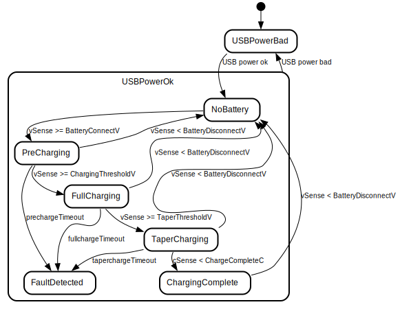

# Charge algorithm

This is the high-level description of our charge algorithm.

State machine:

* NoBattery: Charging is disabled during this state where we are only checking for pack voltage.  
* PreCharging: Charging battery at a very low current (PrechargeC) because the pack seems close to empty.
* FullCharging - Constant current charging at our normal current (FullC) rate.
* TaperCharging - Battery is close to full, charge at a constant voltage TaperV (not constant current).  Charge current will slowly fall as battery chemistry allows.
* ChargingComplete - Once charge current has decreased to ShutoffThresholdC, turn off charger.  
* FaultDetected - If charging takes longer than it should (FIXME, define), force stop charging and indicate there is something wrong.

FIXME add note about how we periodically stop charging to check batterySenseVoltage

TODO make sure the application watchdog stops the board/charging if this FSM stops transitioning in time

TODO Eventually add long term states for monitoring a pack for weeks or months and only occasionally entering the charge states.  Also support charging to a lower level for better health when storing batteries.

## Charge algorithm notes

Lots of good tips here: 

* https://batteryuniversity.com/article/bu-409-charging-lithium-ion
* https://predictabledesigns.com/charging-methods-for-lithium-ion-batteries/
* https://www.electronics-notes.com/articles/electronic_components/battery-technology/li-ion-lithium-ion-charging.php
* https://electronics.stackexchange.com/questions/39298/lithium-ion-battery-charging-practices